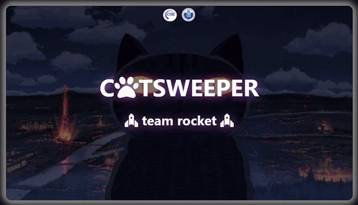
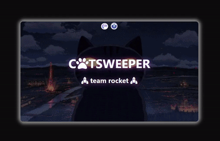
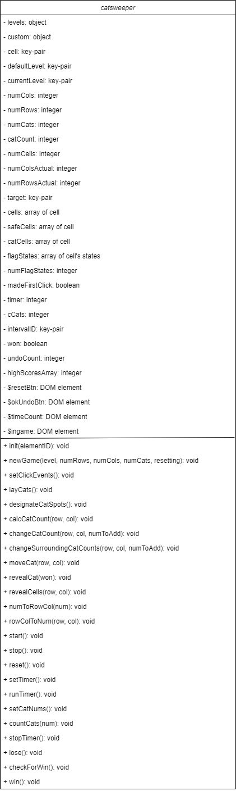

<h6 align="center" style="color: rgb(98, 98, 98);">INTERNATIONAL UNIVERSITY - VNUHCM</h6>

    

 

    
    
    
    
     
    

    
    <h1>CATSWEEPER</h1>    
    Incorporating technologies like HTML, CSS, JavaScript, and ElectronJS, <strong>Catsweeper</strong> is a classic single-player puzzle Minesweeper game designed to enhance learning in Data Structures & Algorithms.

   
 

# Table of Content :clipboard:

1. [Introduction](#Introduction)
2. [Team members](#Team-members)
3. [System design and Modeling](#System-design-and-Modeling)
4. 
5. [Installation](#Installation)
6. [References](#References)

<!-- Introduction -->
# Introduction  :placard:

### Demo :cinema::

    

### About the Minesweeper game:
- The classic Minesweeper game, originating from the early days of personal computing, has remained a classic and captivating single-player puzzle game.
- The Minesweeper game involves a grid of cells, some of which contain hidden mines. Players must strategically reveal cells without mines and use numerical clues provided by neighboring cells to identify and flag the locations of mines. 
- The game is won when all non-mine cells are successfully revealed, and lost if a mine is accidentally uncovered.

### About our Catsweeper game:
- Catsweeper is a strategy game that puts a new spin on the classic Minesweeper game. 
- In this version, players have to avoid clicking on hidden cats that placed randomly on a grid, just like the original mines. The aim is to reveal all the safe squares without hitting a cat. 
- However, what makes the Catsweeper unique are:    
    - The implementation of Depth-First Search (DFS) algorithm to the cat-revealing mechanism
    - A special undo feature, which lets players undo their mistake if they accidently click on a cat. 
    - Background music in each winning and losing scenarios, which may give the gameplay a more upbeat feel.
- This combination of the well-known Minesweeper game with new features creates an engaging and refreshing gaming experience.

<!-- Team members -->
# Team members  :couplekiss_man_woman:
Our Team Rocket includes two members, we are enrolled in the Information Technology program at International University of Ho Chi Minh City.
|Name - Github|Student ID|Tasks|Contribution|
|:------------:|:-----:|:---------------:|:----:|
|Nguyen Thi Yen Chi [nguyenthiyenchi](https://github.com/nguyenthiyenchi)|ITITIU21005|
- Write report - Write mostly function of init() - setClickEvents() - Design UI, Sounds and Effect - Draw Icons - Fix Bugs
|50%|
|Ngo Luu Tan Hung [HngNg](https://github.com/HngNg)|ITITIU21129|
- Write report - Write function of moveCat(), undo() - Implement DSA Algorithm - Draw UML Diagram - Draw Icons - Fix Bugs
|50%|

<!-- System design and Modeling -->
# System design and Modeling  :gear:

### Working tools, platform:
1. __Text Editors/IDEs__: Visual Studio Code (VSCode)
2. __Browser for Testing__: Microsoft Edge
3. __Framework__: ElectronJS
4. __Library__: JQuery
5. __Programming Language__: JavaScript
6. __Front-End Technologies__: HTML5 and CSS3
7. __Collaboration and Communication__: Github

### Class Diagram:

    

### Use Case Scenario:

    

### Use Case Diagram:

    

# Installation  :comet:

# References  :books:
- [Learn How to Create a Minesweeper Game with HTML, CSS, and JavaScrip](https://www.codewithfaraz.com/content/134/learn-how-to-create-a-minesweeper-game-with-html-css-and-javascript)
- [Simple JavaScript Minesweeper](https://code-boxx.com/simple-javascript-minesweeper/)
- [Minesweeper](https://codepen.io/joelbyrd/pen/YPKPbw)
- [Minesweeper Pattern Guide](https://www.youtube.com/watch?v=6vcSO7h6Nt0)
