<h6 align="center" style="color: rgb(98, 98, 98);">INTERNATIONAL UNIVERSITY - VNUHCM</h6>

    

 

    
    
    
    
     
    

    
    <h1>CATSWEEPER</h1>    
    Incorporating technologies like HTML, CSS, JavaScript, and ElectronJS, <strong>Catsweeper</strong> is a classic single-player puzzle Minesweeper game designed to enhance learning in Data Structures & Algorithms.

   
 

# Table of Content :clipboard:

1. [Introduction](#introduction)
2. [Team members](#team-members)
3. [System design and Modeling](#system-design-and-modeling)
4. [UI Interface](#ui-interface)
5. [Installation](#installation)
6. [How to play](#how-to-play)
7. [References](#references)

<!-- Introduction -->
# Introduction  :placard:

### Demo :cinema::

    

### About the Minesweeper game:
- The classic Minesweeper game, originating from the early days of personal computing, has remained a classic and captivating single-player puzzle game.
- The Minesweeper game involves a grid of cells, some of which contain hidden mines. Players must strategically reveal cells without mines and use numerical clues provided by neighboring cells to identify and flag the locations of mines. 
- The game is won when all non-mine cells are successfully revealed, and lost if a mine is accidentally uncovered.

### About our Catsweeper game:
- Catsweeper is a strategy game that puts a new spin on the classic Minesweeper game. 
- In this version, players have to avoid clicking on hidden cats that placed randomly on a grid, just like the original mines. The aim is to reveal all the safe squares without hitting a cat. 
- However, what makes the Catsweeper unique are:    
    - The implementation of Depth-First Search (DFS) algorithm to the cat-revealing mechanism
    - A special undo feature, which lets players undo their mistake if they accidently click on a cat. 
    - Background music in each winning and losing scenarios, which may give the gameplay a more upbeat feel.
- This combination of the well-known Minesweeper game with new features creates an engaging and refreshing gaming experience.

# Team members  :couplekiss_man_woman:

Our Team Rocket includes two members, we are enrolled in the Information Technology program at International University of Ho Chi Minh City.
|Name - Github|Student ID|Tasks|Contribution|
|:------------:|:-----:|:---------------:|:----:|
|Nguyen Thi Yen Chi [nguyenthiyenchi](https://github.com/nguyenthiyenchi)|ITITIU21005|
- Write report - Write mostly function of init() - setClickEvents() - Design UI, Sounds and Effect - Draw Icons - Fix Bugs
|30%|
|Ngo Luu Tan Hung [HngNg](https://github.com/HngNg)|ITITIU21129|
- Write report - Write function of moveCat(), undo() - Implement DSA Algorithm - Draw UML Diagram - Draw Icons - Fix Bugs
|30%|

<!-- System design and Modeling -->
# System design and Modeling  :gear:

### Working tools, platform:
1. __Text Editors/IDEs__: Visual Studio Code (VSCode)
2. __Browser for Testing__: Microsoft Edge
3. __Framework__: ElectronJS
4. __Library__: JQuery
5. __Programming Language__: JavaScript
6. __Front-End Technologies__: HTML5 and CSS3
7. __Collaboration and Communication__: Github

### Class Diagram:

    

### Use Case Scenario:

    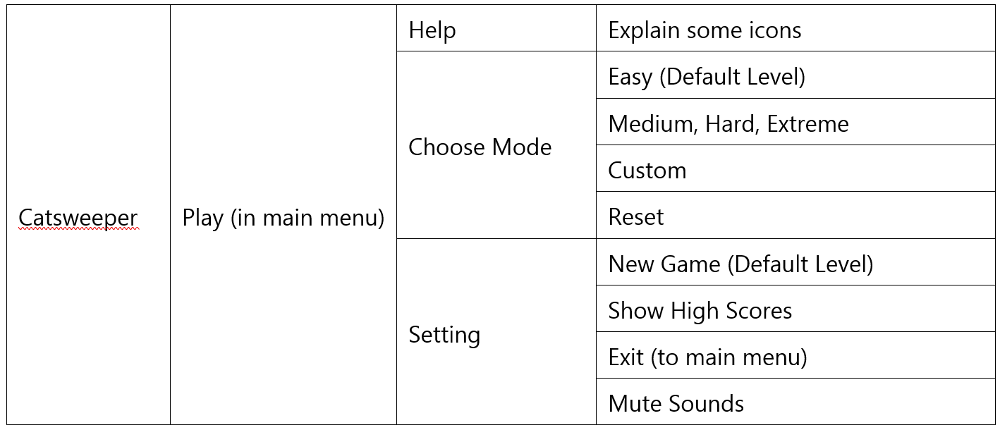

### Use Case Diagram:

    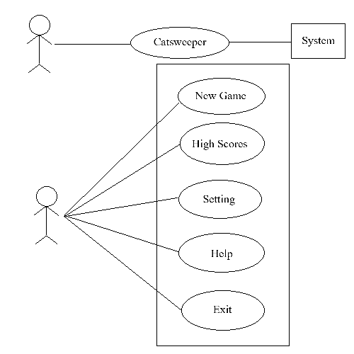

# UI Interface  :sparkles:
### Main Menu State:
This is where users start the game. There includes the game's name, and a big button to begin playing.

    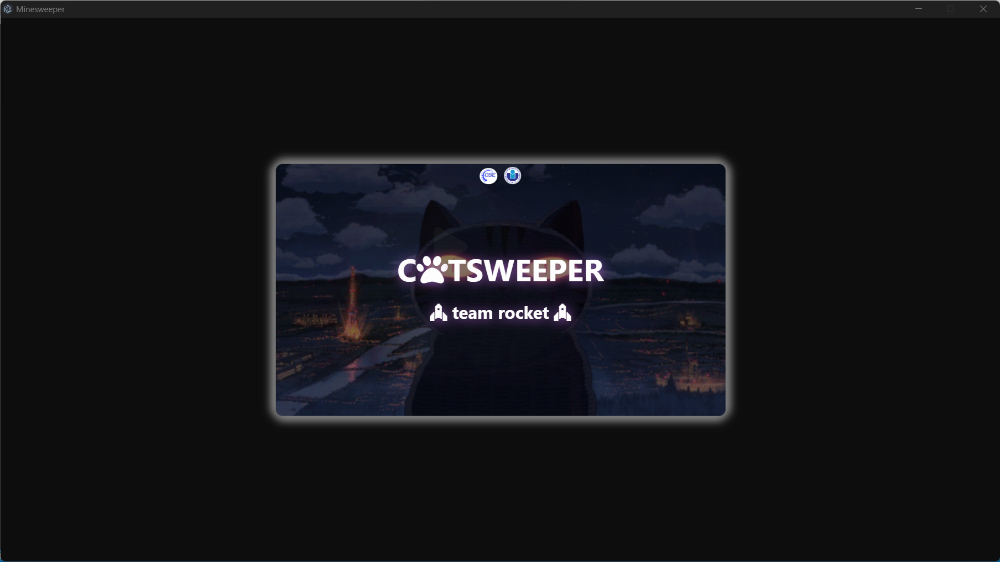

    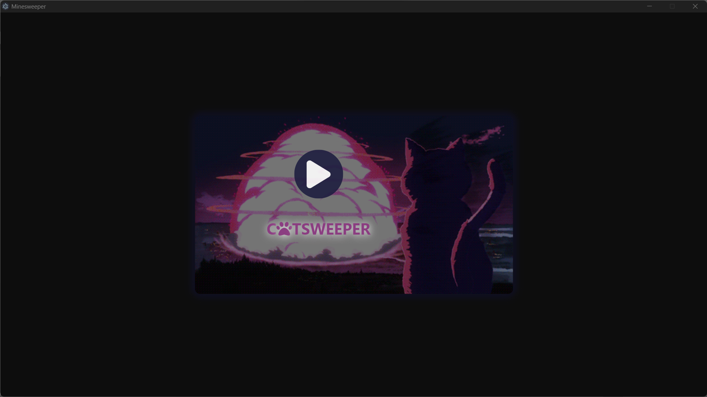

### In-Game State:
Once you press "Play", you enter the actual game.

    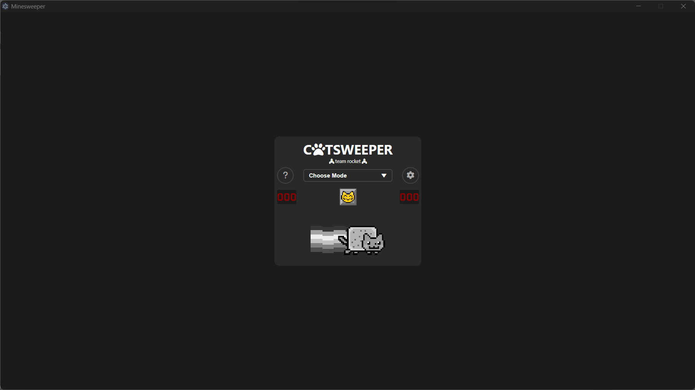

Here, there are a grid of cells. Some cells have mines, some have numbers. Our job is to figure out where the mines are without clicking on them. There's also a timer to see how fast we can finish.

    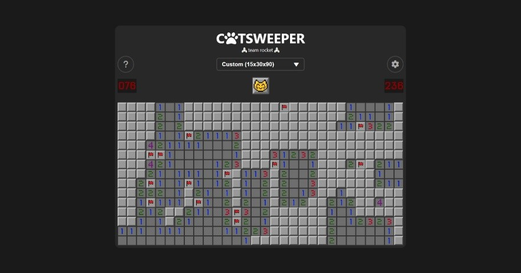

Help, Setting, Highscores

    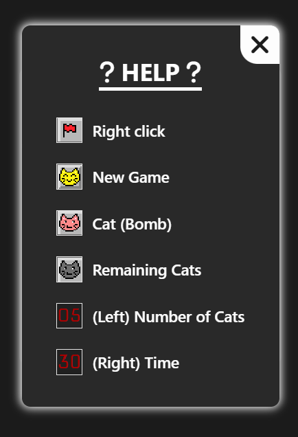
    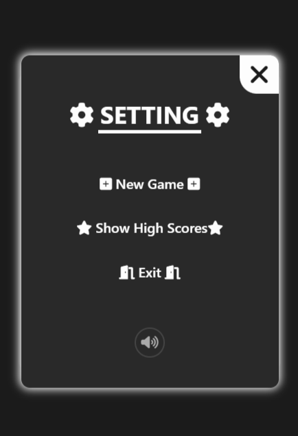
    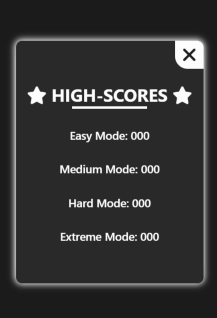

# Installation  :comet:

# How to play   :video_game:
### Begin the game

    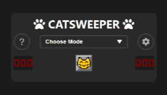

-	Click the Choose Mode tab, and it will show you five options of playing modes, which are: Easy, Medium, Hard, Extreme, and Custom.
-	Users can click Setting or Help icons to open these tabs, and make their further choices.

### How to play
- Tap on a square to open it. The number showed on it indicates exactly how many cats there are surrounding that square.

    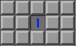

- When users assume that there is a cat, users can flag that cell by right-click on it. For example, if there is a ‘1’ cell, and there is only one unrevealed cell around it, that cell should has a cat, and the users should flag that cell.

    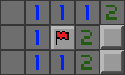

- The game ends when players found a cat. All undiscovered cats will be visible when the game is over. 

    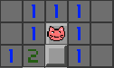

- A player has three chances to undo his/her move. After three times, the player will officially lose, and the cat will cry for a while.

    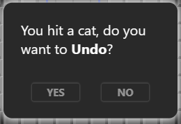

- To win the game, players need to open all safe cells.

    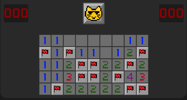

- The user’s score is the number of flag that they placed correct. For each mode, there is a high-score that will update when the user break their record.

    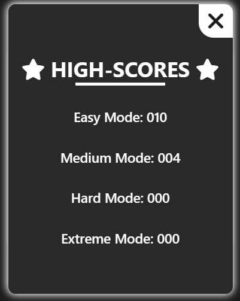

- A new game can be start by choosing a level or clicking the new game button.

    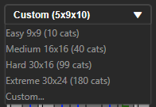

- If the sound of losing/winning game is too noisy, turn off the sound in Setting

# References  :books:
- [Learn How to Create a Minesweeper Game with HTML, CSS, and JavaScrip](https://www.codewithfaraz.com/content/134/learn-how-to-create-a-minesweeper-game-with-html-css-and-javascript)
- [Simple JavaScript Minesweeper](https://code-boxx.com/simple-javascript-minesweeper/)
- [Minesweeper](https://codepen.io/joelbyrd/pen/YPKPbw)
- [Minesweeper Pattern Guide](https://www.youtube.com/watch?v=6vcSO7h6Nt0)
